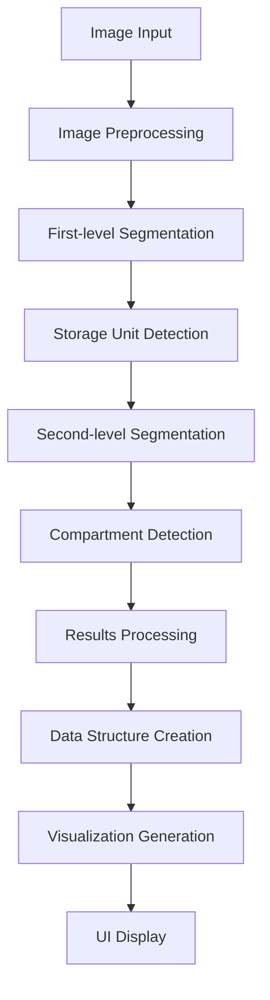

# Storage Segmentation App - Concept Document

## 1. Vision & Overview

### Purpose
A technical demonstration application that uses AI/ML to scan images of storage furniture, identify different storage types, and segment individual compartments within each storage unit.

### Core Functionality
1. Identify and segment different storage furniture (cardboard boxes, dressers, refrigerators, shelves, etc.)
2. Further segment those storage units into their components (drawers, compartments, shelves)
3. Create a structured list of all available storage spaces
4. Display the image with visual annotations showing all identified segments

### Target Users
- Private users managing personal storage
- Small businesses for inventory organization
- Technical demonstration audience

### Value Proposition
This tech demo showcases the capabilities of advanced computer vision techniques for practical storage organization problems, demonstrating how AI can understand hierarchical physical structures.

## 2. Technical Approach

### Primary Implementation: YOLOv8
YOLOv8 will be used as the primary segmentation model due to its:
- Strong performance on instance segmentation tasks
- Pre-trained capabilities that include furniture and container detection
- Efficient processing speed for real-time use
- Support for both object detection and segmentation masks
- Active community and documentation

Required dependencies:
- ultralytics library (YOLOv8)
- OpenCV for image processing
- Streamlit for UI components
- NumPy for numerical operations

### Alternative Candidates for Future Prototypes

1. **Detectron2 (Mask R-CNN)**
   - Pros: Highly accurate for instance segmentation, extensive configuration options
   - Cons: More complex implementation, higher computational requirements

2. **Segment Anything Model (SAM)**
   - Pros: State-of-the-art segmentation capabilities, excellent for fine-grained detail
   - Cons: Larger model size, potentially slower inference

3. **DETR (Detection Transformer)**
   - Pros: Novel architecture with strong performance, good for detecting structured objects
   - Cons: Less documentation, newer approach with fewer examples

## 3. Application Architecture

### System Components



### Data Flow
1. User uploads image
2. Image is preprocessed (resized, normalized)
3. YOLOv8 performs first-pass detection of storage units
4. For each detected unit, second-pass detection identifies compartments
5. Results are compiled into hierarchical data structure
6. Visualization overlays are generated
7. UI displays results to user

## 4. User Interface Design

### Application Structure
The application uses Streamlit to create an intuitive, web-based interface with the following components:

#### Header Section
- Application title and description
- Brief instructions for use

#### Input Section
- File uploader for image selection
- Optional camera input for direct capture
- Sample image selection for demonstration
- Processing options:
  - Confidence threshold slider (0.0-1.0)
  - Detection mode selection (Quick/Detailed)
  - Advanced options in expandable section

#### Results Display
- Side-by-side view of original and annotated images
- Annotation control:
  - Opacity slider for segmentation masks
  - Toggle buttons for different annotation types
  - Multiple visualization tabs (Annotations, Hierarchical, Raw Data)

#### Storage Information Display
- Interactive tree view of storage hierarchy
- Detailed table of all detected elements
- Summary metrics (total units, compartments, etc.)

#### Export Options
- Download annotated image
- Export structured data (CSV, JSON)

### UI Workflow
1. User uploads or selects an image
2. User configures detection parameters
3. Processing occurs with visual progress indication
4. Results are displayed in multiple formats
5. User can interact with results and export as needed

### Mock Interface Layout
```
+-----------------------------------------+
| Storage Segmentation Demo               |
+-----------------------------------------+
|                                         |
| [Upload Image] ▼                        |
|                                         |
| [Process Image]                         |
|                                         |
+-----------------------------------------+
| Original Image       | Annotated Image  |
|                      |                  |
| [Image preview]      | [Image with      |
|                      |  annotations]    |
|                      |                  |
+-----------------------------------------+
| Detected Storage Units:                 |
| ▼ Refrigerator                          |
|   - Top Shelf                           |
|   - Middle Drawer                       |
|   - Bottom Compartment                  |
| ▼ Bookshelf                             |
|   - Top Shelf                           |
|   - Middle Shelf                        |
|   - Bottom Shelf                        |
+-----------------------------------------+
| [Download Results]                      |
+-----------------------------------------+
```

## 5. Implementation Plan

### Development Environment
- Python 3.8+
- Required packages:
  - streamlit
  - ultralytics
  - opencv-python
  - numpy
  - pillow
  - pandas

### Implementation Phases
1. **Setup & Foundation**
   - Environment configuration
   - Basic UI skeleton
   - Image upload functionality

2. **YOLOv8 Integration**
   - Model initialization
   - Basic object detection
   - Result parsing

3. **Two-Stage Detection Pipeline**
   - First-level storage unit detection
   - Second-level compartment detection
   - Hierarchy building

4. **UI Enhancement**
   - Interactive elements
   - Visualization components
   - Data export functionality

5. **Testing & Refinement**
   - Performance testing
   - UI/UX improvements
   - Edge case handling

### Code Structure
```
├── app.py                # Main Streamlit application
├── model/
│   ├── detector.py       # YOLOv8 integration
│   └── processor.py      # Image processing pipeline
├── utils/
│   ├── visualization.py  # Visualization tools
│   └── storage_data.py   # Data structures
└── data/
    └── models/           # Pre-trained model files
```

## 6. Future Enhancements

### Model Improvements
- Fine-tuning YOLOv8 on custom storage dataset
- Implementing ensemble approach with multiple models
- Adding 3D reconstruction capabilities

### Feature Expansion
- Storage capacity estimation
- Item recognition within compartments
- Recommendation engine for optimal storage
- Multiple image support for composite view

### Technical Evolution
- Mobile app version
- Cloud deployment
- Real-time video processing
- AR integration for live overlay
