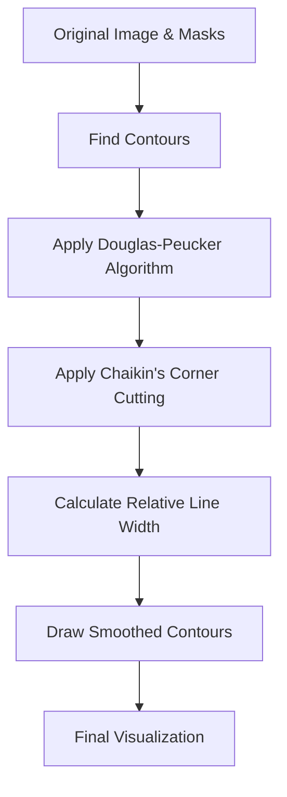

# Post-Processing Enhancement Implementation Plan

## Overview

Based on your requirements, we'll implement two key improvements to the segmentation visualization:

1. **Relative Line Size**: Change border lines from fixed width to 0.3% of image width (minimum 1px)
2. **Enhanced Smoothing**: Combine increased epsilon factor with Chaikin's corner cutting algorithm for smoother contours with rounded corners

## Detailed Implementation Plan



### 1. Code Modifications

We'll need to make the following changes to `utils.py`:

#### A. Add New Helper Functions

```python
def calculate_line_width(image_width, factor=0.003, min_width=1):
    """
    Calculate line width as a percentage of image width.
    
    Args:
        image_width: Width of the image in pixels
        factor: Percentage factor (0.003 = 0.3%)
        min_width: Minimum width in pixels
        
    Returns:
        Line width in pixels
    """
    return max(min_width, int(image_width * factor))

def chaikin_corner_cutting(points, iterations=2):
    """
    Apply Chaikin's corner cutting algorithm for smooth curves with rounded corners.
    
    Args:
        points: List of points [(x1,y1), (x2,y2), ...]
        iterations: Number of iterations to perform
        
    Returns:
        Smoothed points with rounded corners
    """
    if len(points) < 3:
        return points
        
    for _ in range(iterations):
        new_points = []
        # Process all points except first and last
        new_points.append(points[0])  # Keep first point
        
        for i in range(len(points) - 1):
            p0 = points[i]
            p1 = points[i + 1]
            
            # Calculate 1/4 and 3/4 points
            q = (0.75 * p0[0] + 0.25 * p1[0], 0.75 * p0[1] + 0.25 * p1[1])
            r = (0.25 * p0[0] + 0.75 * p1[0], 0.25 * p0[1] + 0.75 * p1[1])
            
            new_points.append(q)
            new_points.append(r)
        
        new_points.append(points[-1])  # Keep last point
        points = new_points
        
    return points
```

#### B. Modify the Smooth Contour Function

```python
def smooth_contour(contour, epsilon_factor=0.015, apply_chaikin=True, chaikin_iterations=2):
    """
    Smooth a contour using Douglas-Peucker algorithm and Chaikin's corner cutting.
    
    Args:
        contour: OpenCV contour
        epsilon_factor: Smoothing factor (higher = more smoothing)
        apply_chaikin: Whether to apply Chaikin's corner cutting
        chaikin_iterations: Number of Chaikin iterations
        
    Returns:
        Smoothed contour
    """
    # Apply Douglas-Peucker algorithm to reduce points
    perimeter = cv2.arcLength(contour, True)
    epsilon = epsilon_factor * perimeter
    approx_contour = cv2.approxPolyDP(contour, epsilon, True)
    
    if not apply_chaikin or len(approx_contour) < 3:
        return approx_contour
    
    # Convert to list of points for Chaikin's algorithm
    points = [tuple(point[0]) for point in approx_contour]
    
    # Apply Chaikin's corner cutting for rounded corners
    smoothed_points = chaikin_corner_cutting(points, iterations=chaikin_iterations)
    
    # Convert back to OpenCV contour format
    return np.array(smoothed_points).reshape(-1, 1, 2).astype(np.int32)
```

#### C. Update the Visualization Function

We need to modify the `visualize_segmentation` function to:
1. Calculate the relative line width based on image width
2. Use the enhanced smoothing function
3. Apply these changes to both storage unit and compartment contours

The key changes will be in the contour drawing sections:

```python
# At the beginning of the visualize_segmentation function
# Calculate line width based on image width
line_width = calculate_line_width(image.shape[1])  # image.shape[1] is the width

# Then in the contour drawing sections for both units and compartments:
# Draw the contours on the overlay
for contour in contours:
    # Smooth the contour with enhanced smoothing
    smoothed_contour = smooth_contour(contour, epsilon_factor=0.015, apply_chaikin=True, chaikin_iterations=2)
    
    # Convert contour points to a list of tuples for PIL
    contour_points = [tuple(point[0]) for point in smoothed_contour]
    
    # Fill the contour with semi-transparent color
    if len(contour_points) > 2:  # Need at least 3 points to draw a polygon
        overlay_draw.polygon(contour_points, fill=(*unit_color, int(255 * alpha)))
        
        # Create darker color for the border
        border_color = darken_color(unit_color)
        
        # Draw the contour outline with relative width and darker color
        overlay_draw.line(contour_points + [contour_points[0]], fill=(*border_color, 255), width=line_width)
```

### 2. Implementation Steps

1. **Add the new helper functions** at the top of the file after the existing imports and helper functions
2. **Replace the existing `smooth_contour` function** with the enhanced version
3. **Modify the `visualize_segmentation` function** to:
   - Calculate the relative line width at the beginning
   - Update the contour drawing code for both storage units and compartments

### 3. Testing Strategy

To ensure the changes work as expected, we should test with:

1. **Various image sizes** to verify the line width scales correctly
2. **Different types of storage furniture** to check how the smoothing affects various shapes
3. **Adjusting parameters** to find the optimal balance:
   - Epsilon factor (0.01-0.02 range)
   - Chaikin iterations (1-3 range)

### 4. Fallback Options

If the implementation doesn't provide the desired results, we can:

1. **Adjust the epsilon factor** - increase for more smoothing, decrease for more detail
2. **Change the number of Chaikin iterations** - more iterations create smoother corners but may distort shapes
3. **Try alternative approaches** like Gaussian blur before contour detection

## Expected Results

The implementation should result in:

1. **Proportional border lines** that scale with image size (0.3% of width)
2. **Smoother contours** with fewer vector points
3. **Rounded corners** instead of sharp angles
4. **More professional appearance** of the segmentation visualization