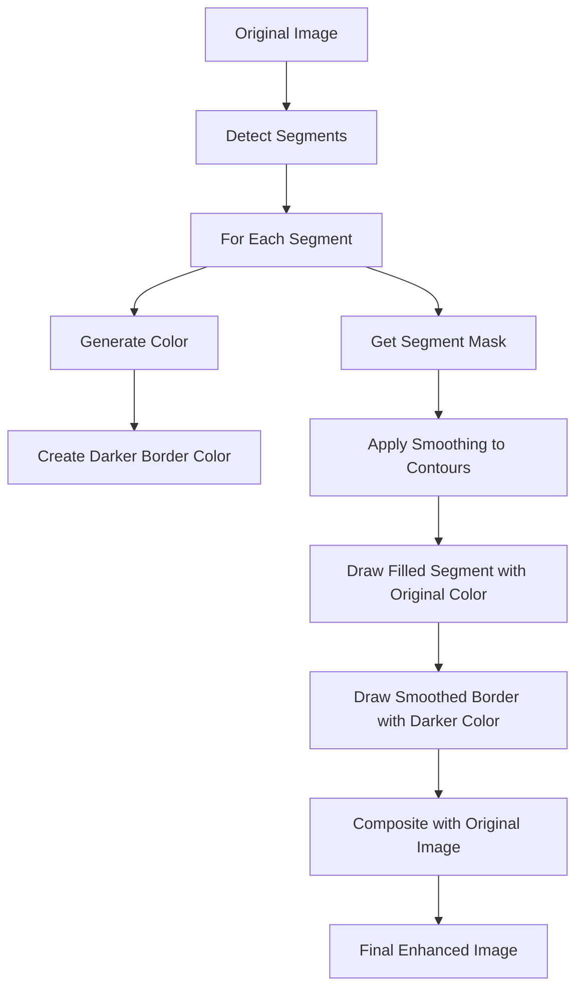

# Post-Processing Enhancement Plan

## Current Implementation Analysis
Currently, the segmentation visualization in `visualize_segmentation` function:
- Creates semi-transparent colored overlays for each segment
- Draws contour lines with fixed widths (3px for units, 2px for compartments)
- Uses the same color for both the fill and the outline
- Directly uses the contours from the segmentation masks without smoothing

## Proposed Enhancements

### 1. Border Enhancement
- Increase border width to 7px for all segments
- Create darker shades of the segment colors for the borders
- Apply the darker color to make borders stand out while maintaining visual connection to the segment

### 2. Contour Smoothing
- Implement contour smoothing to reduce jaggedness
- Use OpenCV's `approxPolyDP` or apply Gaussian blur to the mask before finding contours
- Balance smoothing to maintain accurate representation while reducing noise

### 3. Implementation Approach



### 4. Code Modifications

We'll need to modify the `visualize_segmentation` function in `utils.py` to:

1. Create a helper function to generate darker shades of colors:
   ```python
   def darken_color(color, factor=0.7):
       """Create a darker shade of a color."""
       r, g, b = color
       return (int(r * factor), int(g * factor), int(b * factor))
   ```

2. Add contour smoothing:
   ```python
   def smooth_contour(contour, epsilon_factor=0.005):
       """Smooth a contour using Douglas-Peucker algorithm."""
       perimeter = cv2.arcLength(contour, True)
       epsilon = epsilon_factor * perimeter
       return cv2.approxPolyDP(contour, epsilon, True)
   ```

3. Update the contour drawing code to:
   - Use 7px width for borders
   - Apply the darker color for borders
   - Apply smoothing to contours before drawing

## Testing Strategy
1. Test with various images of storage furniture
2. Adjust smoothing parameters to find the optimal balance
3. Verify that the borders enhance visibility without obscuring details
4. Ensure the smoothing reduces jaggedness without distorting the segment shapes

## Expected Results
- Clearer visual boundaries between segments
- More professional and polished appearance
- Improved user experience when analyzing segmentation results
- Maintained accuracy of the segmentation while reducing visual noise

## Implementation Details

### Modified `visualize_segmentation` Function

The key changes to the existing function will be:

1. Add helper functions for color darkening and contour smoothing
2. Modify the contour drawing code for both storage units and compartments:
   - Increase line width to 7px
   - Use darker color for borders
   - Apply smoothing to contours before drawing

### Alternative Smoothing Approaches

If the Douglas-Peucker algorithm doesn't provide sufficient smoothing, we can explore:

1. Gaussian blur on the mask before contour detection:
   ```python
   # Apply Gaussian blur to smooth the mask
   smoothed_mask = cv2.GaussianBlur(mask_uint8, (5, 5), 0)
   contours, _ = cv2.findContours(smoothed_mask, cv2.RETR_EXTERNAL, cv2.CHAIN_APPROX_SIMPLE)
   ```

2. Spline interpolation for smoother curves:
   ```python
   # Convert contour to a smoother spline curve
   # This would require additional implementation using scipy or similar libraries
   ```

3. Chaikin's corner cutting algorithm for iterative smoothing:
   ```python
   def chaikin_corner_cutting(points, iterations=2):
       """Apply Chaikin's corner cutting algorithm for smooth curves."""
       for _ in range(iterations):
           new_points = []
           for i in range(len(points) - 1):
               p0 = points[i]
               p1 = points[i + 1]
               q = (0.75 * p0[0] + 0.25 * p1[0], 0.75 * p0[1] + 0.25 * p1[1])
               r = (0.25 * p0[0] + 0.75 * p1[0], 0.25 * p0[1] + 0.75 * p1[1])
               new_points.extend([q, r])
           points = new_points
       return np.array(points).reshape(-1, 1, 2).astype(np.int32)